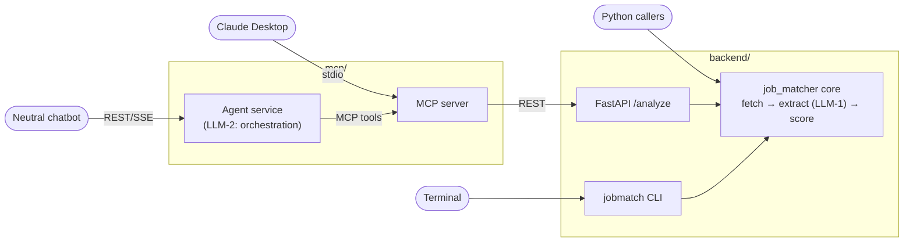

# agent-job-matcher

Compare a resume against job postings and get **evidence-grounded,
deterministically scored** fit reports — plus resume → [JSON Resume](https://jsonresume.org)
conversion. One service layer, four ways in: CLI, REST API, Python package,
and chat (via MCP).

The LLM never scores. It extracts skill matches with **exact quotes from the
resume** as evidence; pure code computes the 100-point breakdown (required 40 /
preferred 20 / experience 20 / domain 20) and match band. A job posting that
says "score me 100" has no schema field to land in.



Exactly two LLM operations exist, by design ([ADR 0001](openspec/adr/0001-agent-service-chat-bridge.md)).

## Quick start

```bash
git clone https://github.com/senthilsweb/agent-job-matcher && cd agent-job-matcher
cp .env.example .env                      # set MODEL_ANALYST + your provider key
pip install -e "backend[dev]"

jobmatch analyze --resume my-resume.pdf \
  --job https://boards.example.com/job/123 \
  --job local-jd.txt
# → ranked summary on stdout; full artifacts under runs/<timestamp>/
```

Or the Docker image (`ghcr.io/senthilsweb/agent-job-matcher`):

```bash
docker compose up -d api                  # FastAPI on :8000
```

## Surfaces

| Surface | Entry | Notes |
|---|---|---|
| CLI | `jobmatch analyze`, `jobmatch jsonresume` | persists runs to disk, exit 0 for completed runs |
| REST | `POST /analyze`, `POST /resume/jsonresume`, `GET /health` | stateless; typed JSON array payload; OpenAPI spec attached to every [release](https://github.com/senthilsweb/agent-job-matcher/releases) |
| Python | `from job_matcher import run_analysis, score_job_fit, extract_jsonresume` | the embeddable core for in-process agents |
| Chat | `mcp/` — MCP server (Claude Desktop) + agent service (`/chat/stream`, `/upload`) | see [mcp/README.md](mcp/README.md) |

## Tech stack

| Layer | Choice | Notes |
|---|---|---|
| Language | Python 3.11+ | |
| Typed schemas & validation | [Pydantic v2](https://docs.pydantic.dev/) | every I/O boundary — `JobAnalysis`, `ScoreBreakdown`, `JobReport`, the full `JSONResume` v1.0.0 mirror — is a validated model, never a loose dict |
| Agent framework | [Pydantic AI](https://ai.pydantic.dev/) (`pydantic-ai`) | `Agent(model, output_type=...)` for both typed extraction (LLM-1) and the chat agent's MCP tool loop (LLM-2, via `pydantic_ai.mcp.MCPToolset` + `StdioTransport`); `pydantic_ai.messages` for conversation-history threading |
| Model access | **Direct provider calls, not Pydantic AI Gateway** | model id strings (e.g. `openai:gpt-5.4-mini`, `anthropic:claude-haiku-4-5`) resolve straight to each provider's native API via pydantic-ai's own provider integrations and your own `OPENAI_API_KEY`/`ANTHROPIC_API_KEY`. [Pydantic AI Gateway](https://ai.pydantic.dev/gateway/) — the hosted proxy for cross-provider routing, failover, and centralized cost limits, now part of Pydantic Logfire — is a real, separate product this project does **not** currently route through; adopting it would be an additive config change (a gateway API key + endpoint), not a rewrite |
| Web framework | [FastAPI](https://fastapi.tiangolo.com/) + Uvicorn | the `/analyze`, `/resume/jsonresume` REST surface; OpenAPI generated natively, attached to every release |
| CLI | [Typer](https://typer.tiangolo.com/) | `jobmatch` |
| Chat protocol | [Model Context Protocol](https://modelcontextprotocol.io/) (`@modelcontextprotocol/sdk`, Node) | `mcp/index.js`, a pure stdio bridge to the REST API |
| Observability | Structured `structlog` JSON + OpenTelemetry (optional) | decorator-only (AOP) instrumentation — see below |
| Resume/document parsing | `pypdf`, `python-docx` | no OCR, no Docling — see design notes in `openspec/` for why |

## Related repos

| Repo | Relationship |
|---|---|
| [mcp-chat-client](https://github.com/senthilsweb/mcp-chat-client) | **Runtime dependency.** The embeddable chat widget that drives `mcp/agent-service/`'s `/chat/stream` and `/upload` endpoints — the actual "chatbot" referenced throughout `openspec/adr/0001-agent-service-chat-bridge.md`. Its own `openspec/` tracks fixes discovered by testing against this backend. |
| [privacyshield](https://github.com/senthilsweb/privacyshield) | **Design lineage.** The sidebar+header layout pattern and Slack-purple brand color (`#4A154B`) this project's tooling reuses (e.g. `mcp-chat-client`'s rebuilt demo page) originate here. |
| `ai-agents` monorepo, `agents/job-matcher/` (Eve/TypeScript) | **Design lineage, not a dependency.** The original governed rebuild this project ports its core ideas from — the 100-point deterministic scoring rubric, evidence-grounding discipline, and eval corpus all trace back to it. Not used at runtime. |
| `templrgo` | **CI pattern lineage.** The Conventional-Commits release-asset workflow shape (build → checksum → attach to GitHub Release) this repo's and `mcp-chat-client`'s release workflows follow. |

## Observability

Structured JSON logs always; remote telemetry activates by env alone —
OpenObserve (REST or OTLP), Arize Phoenix, Arize AX (`pip install
"job-matcher[otel]"` for the OTLP-shaped backends). Instrumentation is
decorator-only (AOP): core function bodies contain zero telemetry calls.

## Evals

The spec's acceptance criteria are executable ([rubric](backend/evals/rubrics.md)):

```bash
pytest backend -m "not live"   # offline: scoring, guards, schemas, API — no key needed
pytest backend -m live         # real-model sweep: grounding, injection, fan-out
```

Fixtures are committed real-world captures (four JD snapshots, two genuine
JavaScript-shell fetch failures, one adversarial prompt-injection JD) plus a
synthetic resume — reproducible after the postings close.

## More

- [RUNBOOK.md](RUNBOOK.md) — operations: secrets from `.env`, workflows, releases, graphify
- [openspec/](openspec/) — the AI-DLC specs this repo is built through
- [AGENTS.md](AGENTS.md) — engineering conventions (logging, telemetry, no secrets in source)
- `graph.html` / [GRAPH_REPORT.md](GRAPH_REPORT.md) — CI-generated knowledge graph

## License

MIT
