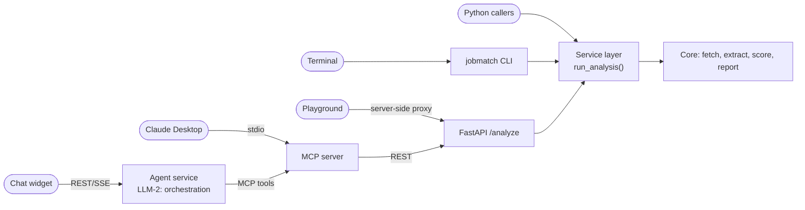
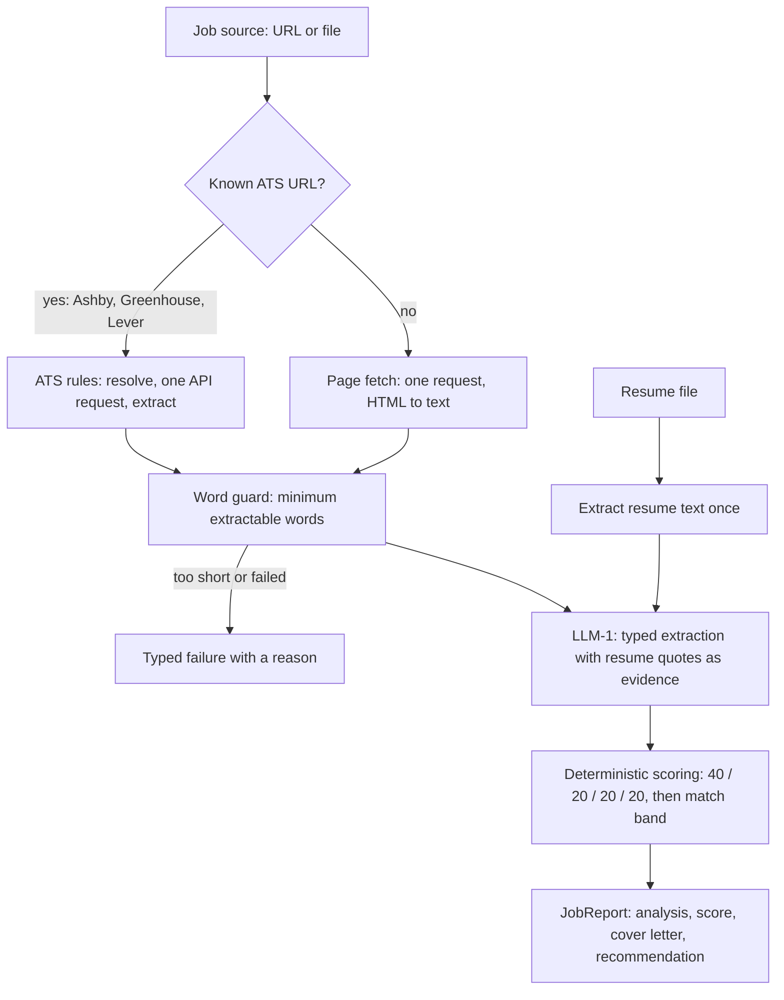

# Architecture

At the end you will know how one request flows from a resume and job links
to scored reports, where each responsibility lives in the code, and which
rules the design never breaks.

## The shape

Four entry points share one service layer. Nothing that matters lives in an
adapter.

## One request, end to end

Each job source becomes its own asynchronous task. One job failing never
disturbs the others, and the number running at once is capped by
`JOB_FANOUT_CONCURRENCY`.

The model never scores. It returns typed matches with exact resume quotes,
and plain code computes the number. Results are always a typed array of
reports and failures, the same on every surface.

## Where each responsibility lives

| Concern | Module | Notes |
|---|---|---|
| Run identity and fan-out | `pipeline.py` | one `run_id` per request, no workflow layer |
| Getting job text | `fetch.py` | scheme and blocked-host checks, byte cap, word guard, one attempt |
| Job boards with an API | `ats.py` and `ats_rules/` | routing and field picking as JSON rules, see [ATS rules](ats-rules.md) |
| Resume text and identity | `resume.py`, `candidate.py` | `pypdf` and `python-docx`, no OCR |
| Extraction (LLM-1) | `analyze.py`, `prompts/` | typed output, no score field exists to inject into |
| Scoring and banding | `scoring.py` | pure functions, fully deterministic |
| Contracts | `schemas.py` | every boundary is a Pydantic model |
| Configuration | `config.py` | the only place environment is read |
| Telemetry | `observability/` | decorator-driven, sinks chosen by environment |

## Rules the design never breaks

- **Exactly two model calls exist.** Extraction in the core and chat
  orchestration in the agent service ([FAQ](faq.md#why-exactly-two-llm-operations)).
- **One fetch attempt per source.** No retry loop, and no fallback from an
  ATS API to its page.
- **Configuration comes only from `.env`.** A missing required value is a
  startup error, never a default.
- **Instrumentation is decorator-only.** Function bodies carry no tracing
  calls, and a failing telemetry backend never fails a run.
- **The API contract ships with every release** as generated OpenAPI.

## Deployment

The demo stack is five containers on one port series, described in
[Getting Started](getting-started.md). Every image is built by one workflow
for `linux/amd64` and published to the GitHub Container Registry. Details
are in the [Runbook](runbook.md).

The reasoning behind each choice is recorded next to the code, in
`openspec/adr/` for cross-cutting decisions and in each
`openspec/changes/<name>/design.md` for individual changes.

Next: [ATS rules](ats-rules.md).
