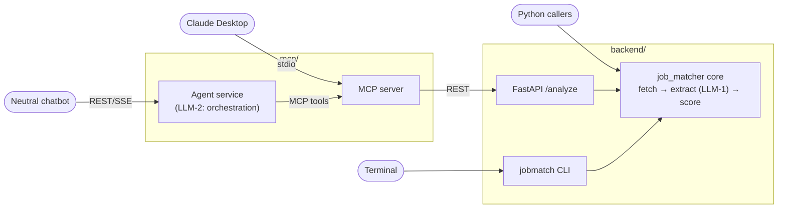

# agent-job-matcher

agent-job-matcher compares a resume against job postings and returns
**evidence-grounded, deterministically scored** fit reports — plus
resume → [JSON Resume](https://jsonresume.org) conversion. One service
layer, four ways in: CLI, REST API, Python package, and chat (via MCP).

The design rule that everything else follows from: **the LLM never
scores.** It extracts skill matches with exact quotes from the resume
as evidence; pure code computes the 100-point breakdown (required 40 /
preferred 20 / experience 20 / domain 20) and the match band. A job
posting that says "score me 100" has no schema field to land in.

Exactly two LLM operations exist, by design
([ADR 0001](https://github.com/senthilsweb/agent-job-matcher/blob/main/openspec/adr/0001-agent-service-chat-bridge.md)):
extraction in the backend core (LLM-1) and chat orchestration in the
agent service (LLM-2). Nothing else calls a model.

## Start where you are

| You are… | Start here |
|---|---|
| Trying it out | [Getting Started](getting-started.md) — a rendered fit report in 5 minutes |
| Setting it up properly | [Installation](installation.md), then [Configuration](configuration.md) |
| Integrating (API, Python, chat) | [Surfaces](surfaces.md) |
| Operating it (releases, secrets, CI) | [Runbook](runbook.md) |
| Wondering why it works this way | [FAQ & Design Decisions](faq.md) |

## Tech stack

| Layer | Choice | Notes |
|---|---|---|
| Language | Python 3.11+ | |
| Typed schemas & validation | [Pydantic v2](https://docs.pydantic.dev/) | every I/O boundary — `JobAnalysis`, `ScoreBreakdown`, `JobReport`, the full `JSONResume` v1.0.0 mirror — is a validated model, never a loose dict |
| Agent framework | [Pydantic AI](https://ai.pydantic.dev/) | `Agent(model, output_type=...)` for typed extraction (LLM-1) and the chat agent's MCP tool loop (LLM-2) |
| Model access | direct provider calls | no gateway in the path — [FAQ](faq.md#why-direct-provider-calls-instead-of-a-gateway) |
| Web framework | [FastAPI](https://fastapi.tiangolo.com/) + Uvicorn | OpenAPI generated natively, attached to every release |
| CLI | [Typer](https://typer.tiangolo.com/) | `jobmatch` |
| Chat protocol | [Model Context Protocol](https://modelcontextprotocol.io/) (Node SDK) | `mcp/index.js`, a pure stdio bridge to the REST API |
| Observability | structured `structlog` JSON + optional OpenTelemetry | decorator-only (AOP) instrumentation — [Configuration](configuration.md#telemetry-activates-by-env-alone) |
| Document parsing | `pypdf`, `python-docx` | no OCR, no Docling — [FAQ](faq.md#why-pypdfpython-docx-and-not-ocr-or-docling) |

## Related repos

| Repo | Relationship |
|---|---|
| [mcp-chat-client](https://github.com/senthilsweb/mcp-chat-client) | **Runtime dependency.** The embeddable chat widget that drives the agent service's `/chat/stream` and `/upload` endpoints. |
| [ai-dlc](https://github.com/senthilsweb/ai-dlc) | **Methodology & training deck.** This project is the running example of the AI-DLC spec-first cycle. |
| [ai-agents](https://github.com/senthilsweb/ai-agents) | The monorepo whose `job-scout` pipeline feeds this API job descriptions at scale — and home of the shared docs style guide. |

## Pages

- [Getting Started](getting-started.md) — three 5-minute paths in.
- [Installation](installation.md) — pip, Docker image, or the full demo stack.
- [Configuration](configuration.md) — every environment variable, grouped by concern.
- [Surfaces](surfaces.md) — CLI, REST, Python, and chat/MCP, with endpoint tables.
- [Runbook](runbook.md) — workflows, secrets, releases, tests.
- [FAQ & Design Decisions](faq.md) — the reasoning, linked to specs.

Docs in this repo follow the shared
[documentation style guide](https://senthilsweb.github.io/ai-agents/style-guide/).
