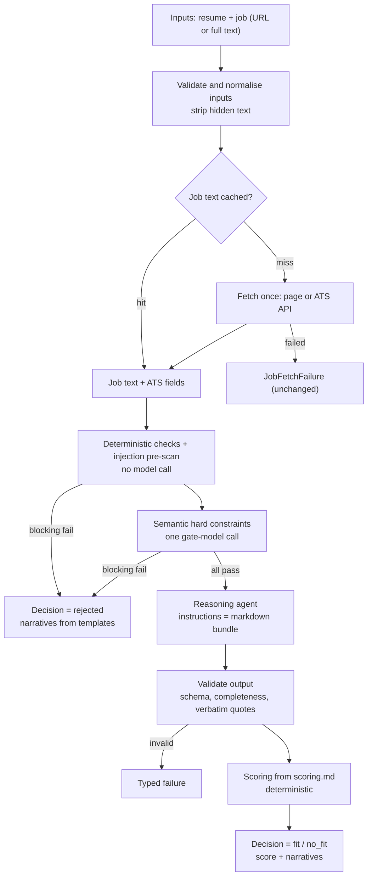

# Design: governed agent architecture

Proposal-stage design. Names, fields, and thresholds are starting points for
review, not decisions.

## 1. Request flow



Each job still runs as its own task under `JOB_FANOUT_CONCURRENCY`, and one
job's failure never affects the others.

## 2. What runs in which layer

Three layers. Only two of them call a model, and each model call is named.

| Concern | Deterministic Python | Gate model (small, OpenAI) | Reasoning agent (markdown-defined) |
|---|---|---|---|
| Input validation: resume type and size, URL scheme, blocked hosts | ✓ | | |
| Job fetch, ATS rules, job cache | ✓ | | |
| Text normalisation, hidden-text stripping | ✓ | | |
| Injection pre-scan, pattern based | ✓ | | |
| Structural hard constraints: posting open, word counts, resume shape | ✓ | | |
| Semantic hard constraints: is it a job, injection intent, minimum experience, mandatory credentials, location mandate | | ✓ | |
| Narratives for deterministic hard constraints, from templates in `hard-constraints.md` | ✓ | | |
| Narratives for semantic hard constraints | | ✓ | |
| Rejection narrative, assembled from the failed checks | ✓ | | |
| Soft constraints: skill matches with resume quotes, experience level, domain level | | | ✓ |
| Soft-constraint narratives, fit narrative, strengths, gaps | | | ✓ |
| Cover-letter paragraphs | | | ✓ |
| Cover-letter rendering from the template | ✓ | | |
| Output validation: schema, completeness, verbatim quotes, consistency | ✓ | | |
| Points, totals, bands, recommendation, from `scoring.md` | ✓ | | |
| Loading and validating the markdown configuration | ✓ | | |
| Telemetry and logging | ✓ | | |

Model calls per job:

| Outcome | Gate calls | Reasoning calls |
|---|---|---|
| Rejected by a deterministic check | 0 | 0 |
| Rejected by a semantic check | 1 | 0 |
| Accepted | 1 | 1 |
| Repeat request, result cache on | 0 | 0 |

## 3. Inputs

The only inputs are **a resume** and **one or more jobs**, each given as a
URL or as full text. There are no candidate preference fields.

| Input | Accepted as |
|---|---|
| Resume | upload (PDF, DOCX, TXT, MD), or a server-side path for the CLI and evals |
| Job | public URL, or full text in a new repeatable `job_text` field; a server-side file path stays for the CLI and evals |

Every constraint must be decidable from these inputs alone.

## 4. The decision contract

Two versioned Pydantic models are the contract. Their JSON Schema is exported
into the bundle, and a test fails if the exported files drift from the code.

**`JobFitRequest` v1**, built by code before any model call:

| Field | Source |
|---|---|
| `request.run_id` | pipeline |
| `candidate.resume_text`, `candidate.resume_hash` | resume extraction |
| `candidate.identity` | `candidate.py` |
| `job.source`, `job.input_kind` (`url` or `text`) | request |
| `job.text`, `job.text_hash` | fetch, cache, or request |
| `job.ats` | ATS rules: title, location, pay, when the source is a known ATS |
| `screening.flags[]` | injection pre-scan and hidden-text findings |

**`GovernedJobDecision` v1**, the response per job:

| Field | Meaning |
|---|---|
| `decision` | `rejected`, `fit`, or `no_fit` |
| `hard_constraints[]` | `{id, status: pass/fail/unknown, severity, governing_fields[], evidence[], narrative}` |
| `soft_constraints[]` | `{id, level, governing_fields[], evidence[], narrative}` |
| `analysis` | today's `JobAnalysis`, kept for compatibility |
| `score_breakdown`, `match_status` | deterministic output; `null` score for a rejection |
| `narrative` | overall explanation, for rejections and fits alike |
| `trace` | engine and bundle version, bundle hash, model ids, cache hits, token usage |

**Governing fields** are dotted paths into these schemas, for example
`job.ats.location` or `analysis.experience_alignment`. Every rule names at
least one, and a test fails on any path that does not exist.

## 5. Hard constraints

Each check answers one yes/no question: `pass`, `fail`, or `unknown`.
Severity comes from `hard-constraints.md`: `blocking` rejects on fail or
unknown, `advisory` passes with a narrative.

Starter catalogue, all decidable from resume and job alone:

| Id | Question | Layer | Default severity |
|---|---|---|---|
| HC-01 | Is the job input actually a job posting? | code (word guard) then gate | blocking |
| HC-02 | Is the posting still open? | code (ATS board) | blocking; `unknown` for text input |
| HC-03 | Is the resume input actually a resume? | code (length, identity) then gate | blocking |
| HC-04 | Does the job text try to instruct the evaluator? | code pre-scan then gate | blocking |
| HC-05 | Does the resume text try to instruct the evaluator? | code pre-scan then gate | blocking |
| HC-06 | Does the resume meet the posting's stated minimum experience, within a tolerance? | gate | advisory |
| HC-07 | Does the posting mandate a credential the resume lacks, such as a licence or clearance? | gate | blocking |
| HC-08 | Does the posting mandate a location or work authorisation the resume contradicts? | gate | advisory |

Code checks run first, and a blocking failure there skips the gate call.
The semantic checks are evaluated together in **one** structured-output
call to a small model set by `MODEL_GATE`, behind a swappable interface.

## 6. Guardrails against injected matches

Hard constraints HC-04 and HC-05 *detect* injection, but detection is
probabilistic and cannot be the only defence. The guarantee comes from
structure: nothing a model writes can become a score directly.

| # | Guardrail | Layer | What it stops |
|---|---|---|---|
| 1 | No model output schema has a score, band, or points field | contract | "score me 100" has nowhere to land |
| 2 | Points and bands come only from `scoring.md` rules in code | code | a model cannot award points |
| 3 | Instructions come only from the bundle; job and resume are fenced, labelled data | prompt assembly | text posing as instructions |
| 4 | Hidden text stripped before any model sees it: zero-width characters, HTML comments, invisible or off-screen elements | code | white-on-white or hidden prompts in pages or resumes |
| 5 | Pattern pre-scan for evaluator-directed phrases in both inputs | code | common injection phrasing, at zero cost |
| 6 | Semantic injection checks HC-04 and HC-05 on the gate model | gate | paraphrased injection the patterns miss |
| 7 | Every matched skill needs a resume quote found verbatim in the resume | code | a match invented by an injected instruction |
| 8 | Consistency checks: level claims must agree with the evidence counts | code | inflated levels without matching evidence |
| 9 | The gate and the reasoning agent can use different models | config | one model's blind spot does not pass both checks |

Guardrails 1, 2, 7, and 8 hold even if every model is fooled. Guardrail 5's
patterns live in `hard-constraints.md`, so they update without code.

## 7. Caching

**Job text cache**, on by default.

- **Key:** the normalised URL, with tracking parameters such as `utm_*` and
  `gh_src` removed. Full-text inputs skip the fetch and are keyed by content
  hash.
- **Value:** the extracted text, ATS fields, fetch time, and content hash.
- **Lifetime:** `JOB_CACHE_TTL_HOURS`. Only successful fetches are cached,
  so a failure is retried on the next request, not replayed.
- **Store:** files under `JOB_CACHE_DIR`, which works for the CLI and for
  the API container with a mounted volume. No database or service.
- **One-attempt rule:** a cache hit makes zero attempts. A miss makes exactly
  one, as today.
- **Staleness:** a posting closed after caching still reads as open until
  the entry expires. The lifetime is the trade-off knob.

**Gate result cache**, on by default. Checks that read only the job, HC-01,
HC-02, and HC-04, are cached by job hash plus rules version plus gate model.

**Full result cache**, off by default. Keyed by resume hash, job hash,
bundle hash, and both models. It makes repeat requests instant and free, but
stores personal data on disk, so it is opt-in with `RESULT_CACHE=on`.

Every response's `trace` records which caches were hit.

## 8. Reasoning agent

**The agent is its files.** At startup the backend loads the bundle, checks
it against `agent.yaml`, and assembles the instructions from `AGENTS.md`,
`SKILL.md`, and `rubric.md`. No governed-path prompt text lives in Python.

**Runtime.** The backend runs it through its existing provider-neutral model
layer, with the model set by `MODEL_REASONER`. The output type is the
reasoning part of `GovernedJobDecision`, so the model can only fill typed
fields. There is no hosted agent platform, session, or container.

**Per accepted job:** one structured-output call, then code validation. An
invalid result is a typed failure, never a partial report.

## 9. Configuration as markdown

Rules and scoring are configurable, and **the markdown files are the only
place they are configured**. Each file has a YAML front-matter block that
code reads and validates, and a prose body for people and the agent.

| File | Front matter configures | Body is |
|---|---|---|
| `hard-constraints.md` | each check's id, question, layer, severity, governing fields, narrative templates, pre-scan patterns | explanation of each rule |
| `rubric.md` | each soft constraint's id, levels, governing fields, completeness rules | assessment guidance for the agent |
| `scoring.md` | category weights, level-to-points maps, empty-preferred reallocation, band thresholds, recommendation text | how the score is calculated, in words |
| `agent.yaml` | bundle name and version, which files form the instructions, schema versions | — |

`scoring.md` starts with today's exact values, so the legacy parity test
still holds: required 40, preferred 20, experience 20, domain 20, and the
same bands.

**Changes ship by deployment.** The files are loaded once at startup and
validated against Pydantic models. Weights must sum to 100, every level
needs points, and every governing field must resolve. Any error stops
startup with a clear message. There is no runtime API for editing rules.
A change is either a commit that rebuilds the image, or an edited copy
mounted through `AGENT_BUNDLE_DIR` at deploy time.

## 10. Narratives

- **Hard constraint:** the rule, the governing values found, and why it
  passed, failed, or was unknown. Code fills templates for code checks; the
  gate writes them for semantic checks.
- **Soft constraint:** why that level, citing the evidence.
- **Decision:** for a rejection, code assembles which checks failed and
  what would change the outcome. For a fit or no-fit, the agent writes the
  strongest reasons and the main gap.
- Narratives are required fields. A missing one is a validation failure.

## 11. Artefact bundle

```
backend/job_matcher/agents/job-fit/
├── AGENTS.md              # role, inputs, outputs, non-negotiables
├── SKILL.md               # how to analyse a job against a resume
├── hard-constraints.md    # checks, severities, templates, pre-scan patterns
├── rubric.md              # soft constraints, levels, completeness rules
├── scoring.md             # weights, points, bands, recommendations
├── agent.yaml             # name, version, instruction files, schema versions
└── schemas/
    ├── job-fit-request.v1.json
    └── governed-job-decision.v1.json
```

The bundle ships as package data inside every image built from `backend/`.

## 12. Configuration variables

| Variable | Purpose |
|---|---|
| `DECISION_ENGINE` | `legacy` (default) or `governed` |
| `MODEL_GATE` | gate model, for example `openai:gpt-5.4-mini` |
| `MODEL_REASONER` | reasoning agent model, provider-prefixed |
| provider keys | whichever the two models need |
| `AGENT_BUNDLE_DIR` | optional override folder for the markdown bundle |
| `JOB_CACHE_DIR`, `JOB_CACHE_TTL_HOURS` | job text cache location and lifetime |
| `RESULT_CACHE` | `off` (default) or `on` |

No endpoint, id, or key gets a source default (AGENTS.md rule 5).

## 13. MCP and chat

The MCP server passes responses through without reading them, so it keeps
working unchanged. Before the default flips, two texts change:

- The chat prompt reports the decision and narratives, and for a rejection,
  which check failed.
- The analyze tool's description says a job can be rejected before scoring.

## 14. Rollout

1. Contract, markdown configuration, and scoring from `scoring.md`, with the
   legacy engine unchanged.
2. Inputs, caching, pre-scan, and the gate, behind `DECISION_ENGINE=governed`.
3. Markdown-defined reasoning agent and output validation.
4. Chat prompt and tool description.
5. Parity run on the eval fixtures, then flip the default.

## 15. Open questions for the owner

1. **Gate provider:** keep OpenAI for the gate, or measure another model?
2. **Reasoning model:** which provider and model for `MODEL_REASONER`?
3. **Severities:** are the default severities in §5 right?
4. **Cache lifetime:** what default for `JOB_CACHE_TTL_HOURS`?
5. **Repair pass:** keep "invalid result is a failure", or allow one repair
   call when only completeness rules fail?
6. **Eval data:** parity needs the `backend/evals/data/` fixtures restored.
