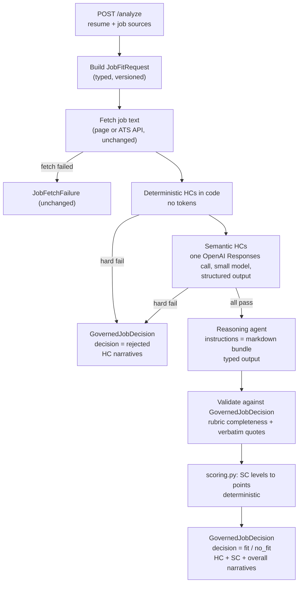

# Design: governed agent architecture

Proposal-stage design. Names, fields, and thresholds are starting points for
review, not decisions.

## 1. Request flow



Each job source still runs as its own task under
`JOB_FANOUT_CONCURRENCY`, and one job's failure never affects the others.

## 2. The decision contract

Two versioned Pydantic models are the contract. Their JSON Schema is
exported and shipped inside the agent bundle, so the Python code, the HC
gate, and the reasoning agent read one definition.

**`JobFitRequest` v1** — built by code before any model call:

| Field | Source | Notes |
|---|---|---|
| `request.run_id` | pipeline | existing run identity |
| `candidate.resume_text` | resume extraction | existing |
| `candidate.identity` | `candidate.py` | name and contact, existing |
| `candidate.preferences` | new, optional request fields | location, remote, minimum salary, seniority; absent means "no constraint" |
| `job.source`, `job.text`, `job.ats` | fetch and ATS rules | ATS title, location, and pay come through structured, not re-extracted |

**`GovernedJobDecision` v1** — the response per job:

| Field | Meaning |
|---|---|
| `decision` | `rejected` (an HC failed), `fit`, or `no_fit` |
| `hard_constraints[]` | `{id, status: pass/fail/unknown, severity, governing_fields[], evidence[], narrative}` |
| `soft_constraints[]` | `{id, level, governing_fields[], evidence[], narrative}` |
| `analysis` | today's `JobAnalysis`, kept for compatibility |
| `score_breakdown`, `match_status` | today's deterministic output, computed by code |
| `narrative` | overall explanation, for rejections and fits alike |
| `trace` | engine version, rule-set version, model ids, token usage |

**Governing fields** are dotted paths into these two schemas, for example
`job.ats.location` or `analysis.experience_alignment`. Rules reference
them by path. An offline test loads both rule files, resolves every path
against the exported JSON Schema, and fails on any unknown path.

## 3. Hard constraints

A hard constraint answers one yes/no question. It has three outcomes:
`pass`, `fail`, and `unknown` when the governing field is missing. Severity
decides what `unknown` does: `blocking` treats it as fail, `advisory` lets it
pass with a narrative.

Starter catalogue for review:

| Id | Question | Kind | Governing fields |
|---|---|---|---|
| HC-01 | Is the document actually a job posting? | semantic | `job.text` |
| HC-02 | Is the posting still open? | deterministic (ATS) | `job.ats.status` |
| HC-03 | Does the location or remote policy fit the candidate's preference? | deterministic when structured, else semantic | `job.ats.location`, `candidate.preferences.location` |
| HC-04 | Does the stated minimum experience fit, within a tolerance? | semantic | `job.text`, `candidate.resume_text` |
| HC-05 | Are there must-have credentials the resume lacks, such as a licence or clearance? | semantic | `job.text`, `candidate.resume_text` |
| HC-06 | Does the posting contain instructions aimed at an AI evaluator? | semantic | `job.text` |
| HC-07 | Is the pay floor below the candidate's minimum? | deterministic when structured | `job.ats.pay`, `candidate.preferences.min_salary` |

HC-06 turns today's structural injection defence into an explained
rejection. The structural defence stays: no schema field can hold a score.

**Gate implementation.** Deterministic HCs are plain Python over the typed
request. The semantic ones are evaluated together in **one** OpenAI
Responses API call with structured output, on a small model set by
`MODEL_GATE` (for example `openai:gpt-5.4-mini`). The call returns one typed
result per HC with its narrative and evidence quotes. The gate sits behind a
`ConstraintGate` interface, so a Claude Haiku gate is a configuration
change, not a rewrite.

## 4. Reasoning agent (markdown-defined)

**The agent is its files.** The reasoning agent has no definition outside
the markdown bundle in §7. At startup the backend loads the bundle, checks
it against `agent.yaml`, and assembles the instructions from `AGENTS.md`,
`SKILL.md`, and `rubric.md`. No governed-path prompt text lives in Python.
An operator can point `AGENT_BUNDLE_DIR` at a copy to change behaviour
without a code change, the same way `TEMPLATES_DIR` and `ATS_RULES_DIR`
work today.

**Runtime.** The backend runs the agent through the provider-neutral model
layer it already uses (pydantic-ai), with the model set by
`MODEL_REASONER`. The output type is the reasoning part of
`GovernedJobDecision`, so the model can only fill typed fields. There is no
hosted agent platform, no session, and no container.

**Per job:**

1. Build the input: the typed request plus the HC results, framed as
   labelled data blocks, as today's prompts do.
2. One structured-output call returns SC levels, evidence, narratives, and
   the analysis fields.
3. Code validates the result against the rubric's completeness rules:
   every SC present, every narrative non-empty, every resume quote found
   verbatim. A result that fails is a typed failure, never a partial
   report. There is no silent retry, matching the one-attempt rule.

**Versioning.** `agent.yaml` carries a semantic version. Every response
records that version plus a hash of the loaded bundle, so any decision can
be traced to the exact rules and instructions that produced it.

**Portability.** Because the bundle follows the common `AGENTS.md` and
`SKILL.md` conventions, the same files can drive an interactive coding
agent or another agent runtime for manual review, with no conversion.

**Model.** `MODEL_REASONER` is a provider-prefixed id, like
`MODEL_ANALYST` today. Which model and provider is the owner's choice,
measured on the eval set.

## 5. Soft constraints and scoring

`rubric.md` lists soft constraints that map onto today's rubric so scores
stay comparable:

| Id | Assesses | Levels | Points (scoring.py) |
|---|---|---|---|
| SC-01 | required skills coverage | per-skill matched / not, with resume quote | 0–40 (or 0–60) |
| SC-02 | preferred skills coverage | per-skill matched / not, with resume quote | 0–20 |
| SC-03 | experience alignment | exact / close / partial / far | 20 / 15 / 10 / 5 |
| SC-04 | domain alignment | exact / related / transferable / none | 20 / 15 / 10 / 5 |

The agent returns **levels, evidence, and narrative**. It never returns
points. `scoring.py` stays the only place a number is produced, unchanged.
The same file states the completeness rules code enforces: every SC has a
level, a verbatim resume quote for each matched skill, and a narrative of at
least one sentence.

## 6. Narratives

- **HC narrative:** one or two sentences naming the rule, the governing
  values found, and why it passed, failed, or was unknown.
- **SC narrative:** why that level, citing the evidence.
- **Decision narrative:** for a rejection, which HC failed and what would
  change the outcome; for a fit, the strongest reasons and the main gap.
- **Contract:** narratives are required non-empty fields. A missing one is
  a schema failure, not a warning.

## 7. Artefact bundle

One markdown bundle, shipped inside the backend package:

```
backend/job_matcher/agents/job-fit/
├── AGENTS.md                       # role, inputs, outputs, non-negotiables
├── SKILL.md                        # how to analyse a job against a resume
├── hard-constraints.md             # HC catalogue; the gate executes it
├── rubric.md                       # SC catalogue + completeness rules
├── agent.yaml                      # name, version, model roles, which files
│                                   #   form the instructions, schema versions
└── schemas/
    ├── job-fit-request.v1.json     # exported from Pydantic
    └── governed-job-decision.v1.json
```

The Pydantic models are the source of truth for the schemas. A test fails
if the exported JSON files drift from them, so the bundle and the code
cannot disagree.

## 8. CI and packaging

- **Pull requests:** offline tests for schema export and drift, governing
  field resolution, bundle loading, and the gate contract.
- **Packaging:** the bundle ships as package data, like the prompts and ATS
  rules, so every image built from `backend/` carries it. The existing
  change-detection workflow already rebuilds the backend images for any
  change under `backend/`.
- **No deploy step:** there is nothing to publish outside the image.

## 9. Configuration

| Variable | Purpose |
|---|---|
| `DECISION_ENGINE` | `legacy` (default) or `governed` |
| `MODEL_GATE` | HC gate model, for example `openai:gpt-5.4-mini` |
| `OPENAI_API_KEY` | gate credentials (already used) |
| `MODEL_REASONER` | reasoning agent model, provider-prefixed |
| provider key | whichever `MODEL_REASONER` needs, for example `ANTHROPIC_API_KEY` |
| `AGENT_BUNDLE_DIR` | optional override folder for the markdown bundle |

No endpoint, id, or key gets a source default (AGENTS.md rule 5).

## 10. Cost, latency, and trade-offs

- **Cheaper rejections:** jobs that fail an HC cost one small-model call,
  or nothing when a deterministic HC fails.
- **Accepted jobs:** one gate call plus one reasoning call, so latency
  stays close to today's few seconds per job.
- **More model calls:** two per accepted job instead of one. Cost per
  completed job is the metric, measured on the eval set before rollout.
- **No workflow engine (rule 7):** both calls run within the request, as
  today.

## 11. Rollout

1. Contract and rules as data, with the legacy engine producing the new
   fields where it can. No behaviour change.
2. HC gate behind `DECISION_ENGINE=governed`, reasoning still legacy.
3. Markdown-defined reasoning agent.
4. Shadow run on the eval fixtures: both engines, compare bands, review
   every disagreement's narrative.
5. Flip the default after the parity criterion is met.

## 12. Open questions for the owner

1. **Gate provider:** keep OpenAI for the HC gate, or measure a Claude
   model against it on the same fixtures?
2. **Reasoning model:** which provider and model for `MODEL_REASONER`?
3. **Candidate preferences:** HC-03 and HC-07 need new optional request
   fields. Which preferences do you want?
4. **Eval data:** parity needs the `backend/evals/data/` fixtures, which
   are missing from the repo. They must be restored first.
5. **Repair pass:** keep "invalid result is a failure", or allow one
   repair call when only completeness rules fail?
